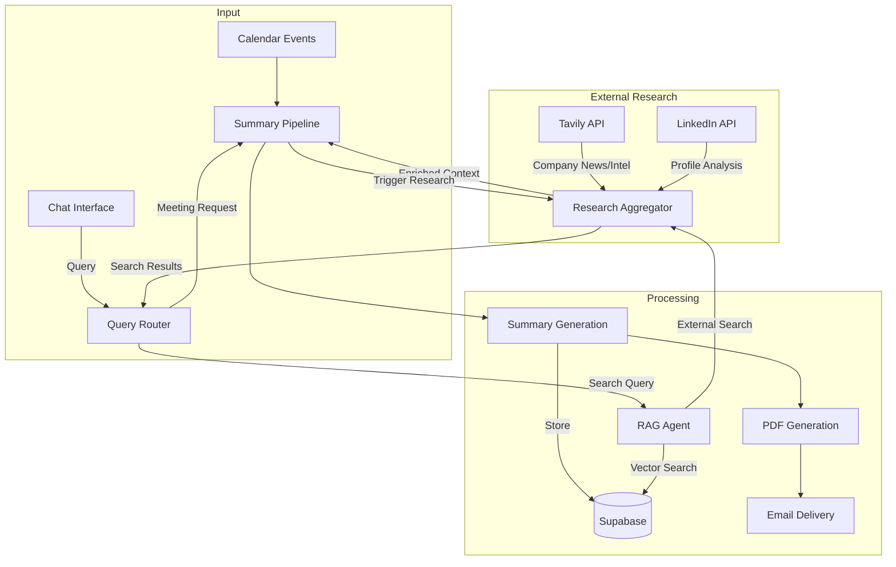

# Core Modules Architecture

## Input Sources

### 1. Calendar Module
- **Trigger:** Google Calendar events monitoring
- **Responsibilities:**
  - OAuth 2.0 authentication
  - Monitor upcoming meetin
  gs
  - Trigger automated preparation pipeline
- **Pipeline Flow:**
  1. Event Detection → external search → Summary Generation
  2. Summary → PDF Creation
  3. PDF → Email Delivery

### 2. Chat Interface
- **Trigger:** User queries/requests
- **Responsibilities:**
  - Gets input through conversation
  - Triggers same pipeline
  - Maintain conversation context
  - Handles follow up questions

## Processing Pipeline

### External Research Agents
- **Components:**
  1. **Tavily Integration**
     - Company research and news
     - Market intelligence
     - Competitive analysis
  2. **LinkedIn Integration**
     - Attendee profiles
     - Professional history
     - Recent activities
- **Triggered by:**
  - Automatically for calendar events
  - On-demand for chat queries
- **Uses:**
  - Tavily API
  - LinkedIn API
  - Gemini for processing

### Summary Generation Agent
- **Triggered by:** 
  - Calendar events (with external research)
  - Chat requests (optional research)
- **Responsibilities:**
  - Combine meeting context
  - Include external research
  - Generate structured briefings
  - Store in Supabase
- **Uses:** 
  - Gemini API
  - OpenAI Embeddings

### RAG (Retrieval) Agent
- **Triggered by:** Chat queries only
- **Responsibilities:**
  - Search meeting history
  - Combine with fresh research
  - Context-aware responses
- **Uses:**
  - OpenAI Embeddings
  - Supabase Vector Store
  - External Research Agents

### PDF Email Agent
- **Triggered by:** New summary generation
- **Responsibilities:**
  - Convert summary to PDF
  - Apply branding/formatting
  - Email to participants
- **Uses:** 
  - Puppeteer (PDF)
  - Nodemailer (Email)

## Data Flow



## Pipeline Triggers

1. **Calendar-Triggered:**
   ```
   Calendar Event → External Research (Tavily + LinkedIn) → Summary Generation → PDF → Email
   ```

2. **Chat-Triggered:**
   ```
   Chat Query → Router → [RAG Search + External Research | Summary Generation]
   ```

## Database Integration

- **Supabase:**
  - Store meeting summaries
  - Vector embeddings
  - Full-text search
  - Meeting metadata
